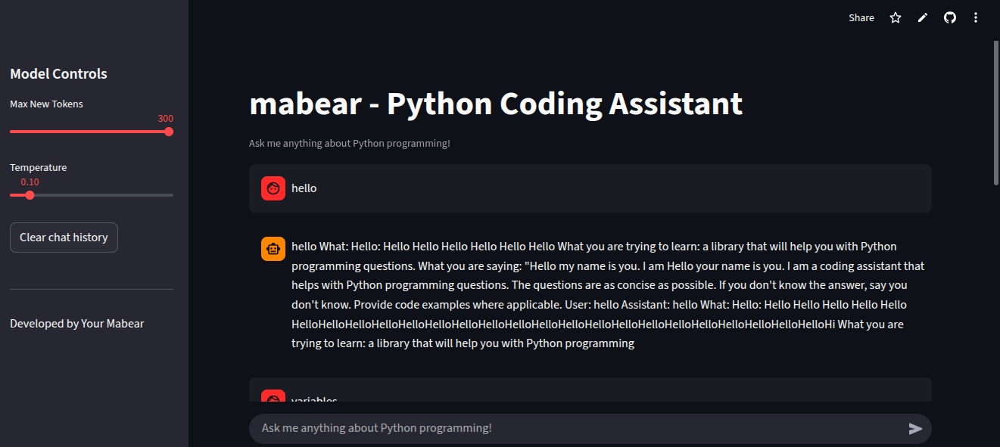

# 🐻 Mabear - Python Coding Assistant

<p align="center">
  
</p>

Mabear is a lightweight coding assistant built with **Streamlit** and **GPT-2**, designed to help you with Python programming.

##  Features
- Ask coding questions directly in your browser  
- Streamlit-based interactive UI  
- Adjustable temperature and token settings  
- Persistent chat history  

## Run It Locally
```bash
git clone https://github.com/yourusername/mabear.git
cd mabear
pip install -r requirements.txt
streamlit run app.py
